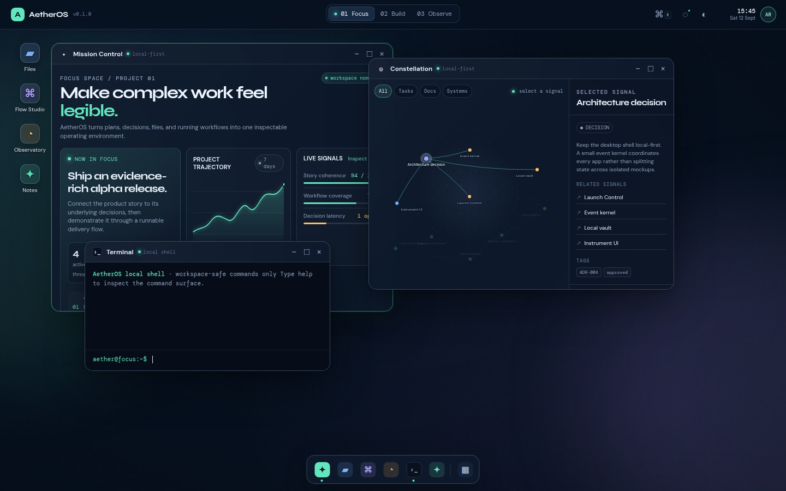
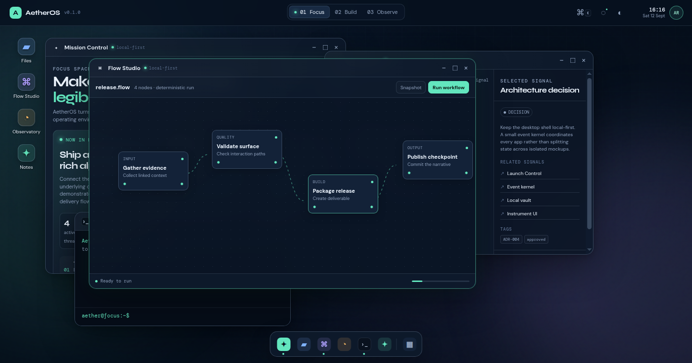
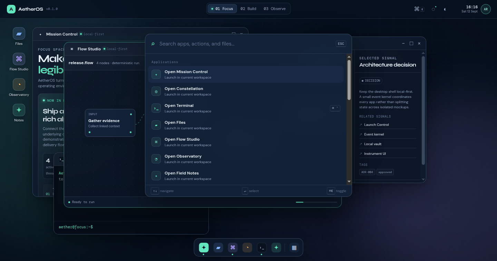

# AetherOS

> A browser-native, local-first operating environment for navigating complex work as a living system.

  

  
  

AetherOS is not a Linux clone or fake kernel. It is a recruiter-facing interaction-systems prototype: a desktop shell where plans, decisions, files, workflows, telemetry, notes, and a safe command surface all read from one persisted workspace model.

## Why it stands out

- Desktop window manager with focus order, drag positioning, minimize/maximize, dock state, and isolated workspaces.
- Interactive **Constellation** graph: project decisions, systems, tasks, documents, and milestones are real linked entities—not decorative SVG.
- A deterministic visual **Flow Studio** whose runtime state is visible in Mission Control, Observatory, notifications, and terminal output.
- A local browser vault for preferences, notes, layout, audit events, terminal history, and recoverable snapshots.
- Keyboard-first command palette and intentionally safe local terminal: help, ls, open, focus, run, status, snapshot, restore, and theme.
- Responsive composition, explicit accessibility labels, and reduced-motion support.

## Run locally

No installation, build step, account, or API key is required:

    python3 -m http.server 4173

Open [http://localhost:4173](http://localhost:4173).

## 30-second demo

1. Start in **Mission Control** and inspect the release objective.
2. Open **Constellation**; select **Architecture decision** and follow its linked signals.
3. Press Cmd/Ctrl + K to find an app, action, or real graph entity.
4. Run “focus architecture” or “run” from the local terminal.
5. Watch the workflow move through Observatory, then capture and restore a local snapshot.

## Architecture

    Desktop shell
      ├─ Window manager / workspaces / dock
      ├─ Shared workspace state + append-only event stream
      ├─ Local persistence + snapshot recovery
      └─ Apps: Mission Control, Constellation, Files,
               Flow Studio, Observatory, Terminal, Notes, Settings

The code intentionally uses a zero-dependency static stack: HTML, modern CSS, SVG, and ES modules. That keeps the whole design inspectable while demonstrating state modeling, complex UI composition, workflow scheduling, local-first persistence, and product design.

## Scope & privacy

AetherOS executes no arbitrary code, makes no API calls, collects no telemetry, and requires no login. It stores only its demo workspace in browser local storage. It is an operating-environment prototype—not a replacement for an operating system.

See [architecture notes](docs/ARCHITECTURE.md) and the [demo guide](docs/DEMO.md). Licensed under [MIT](LICENSE).
